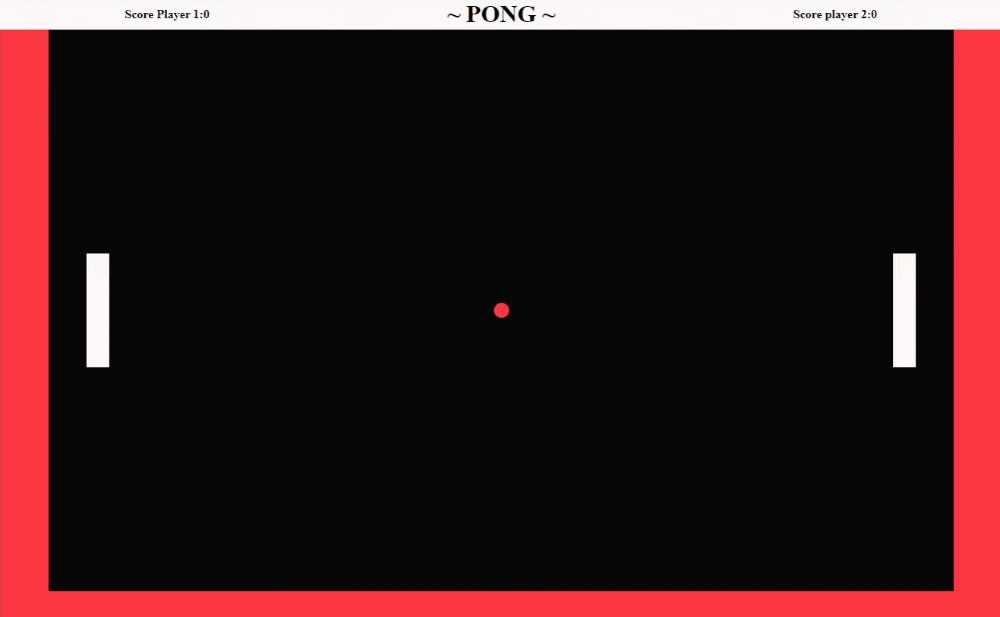

# 🏓 Pong 🏓
✨ This project is a simple remake of the arcade classic Pong with HTML, CSS, and JavaScript.

🎮 How to play:
- "W" and "S" keys move the left paddle.
- "Arrow Up" and "Arrow Down" keys move the right paddle.
- "Spacebar" starts the game. 

🚀 You can play the game at https://cey-s.github.io/Pong/

**Preview:**

